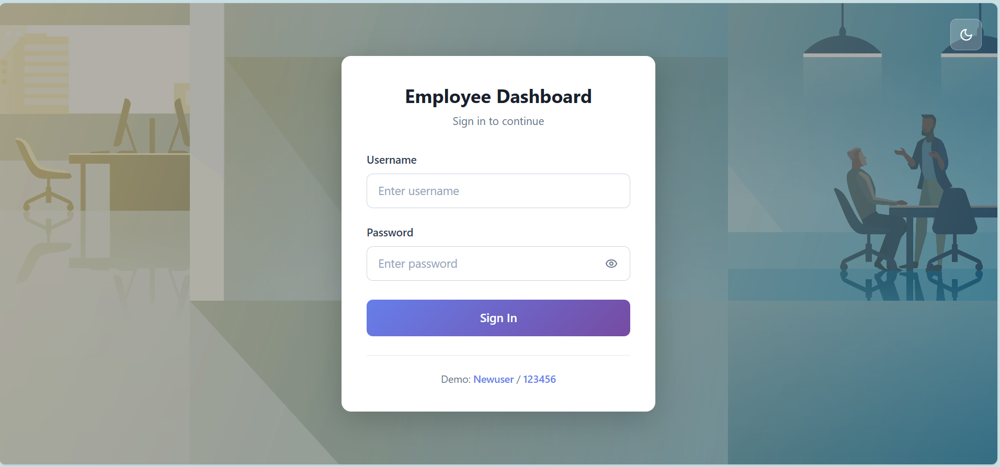
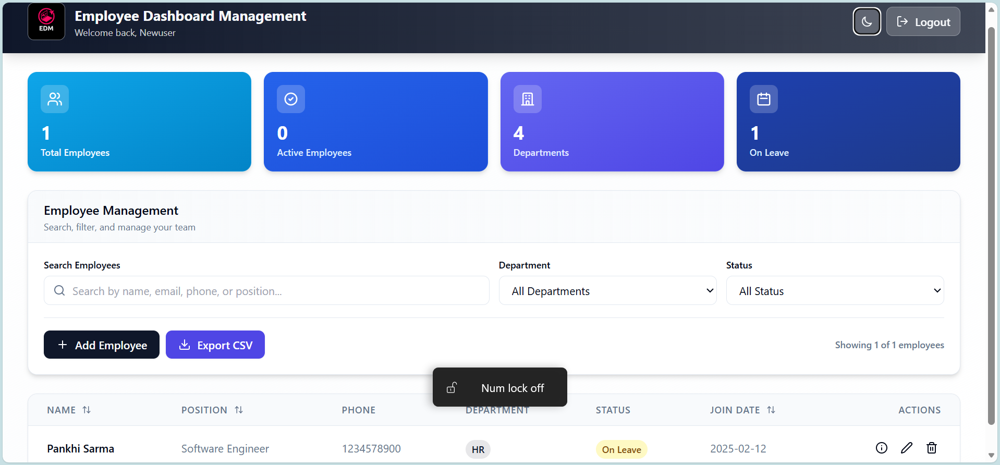
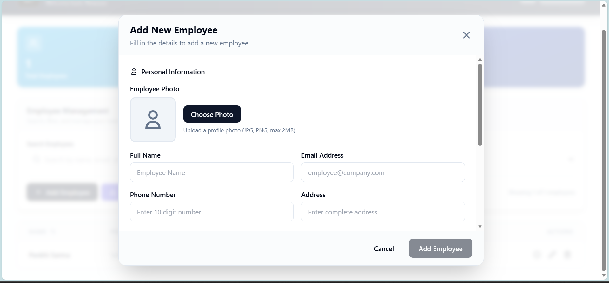
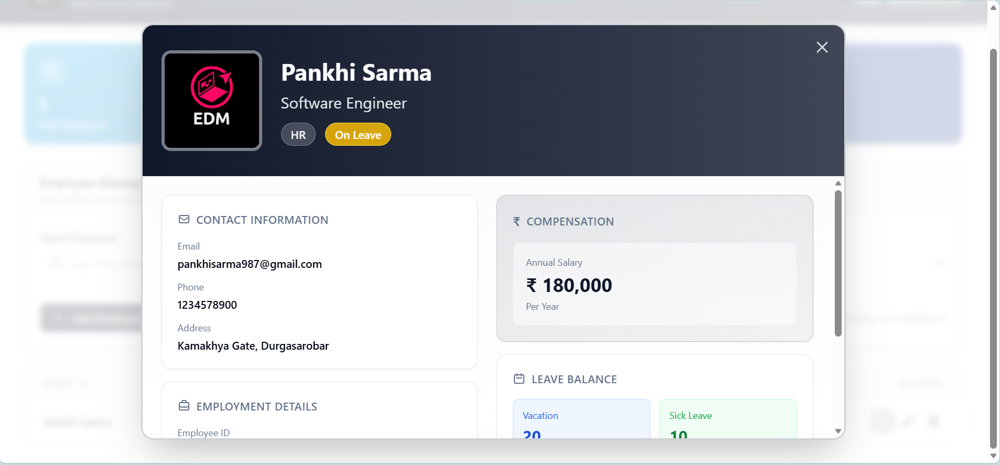

# EDM Dashboard - Employee Data Management System

A modern, professional Employee Data Management system built with **Angular 19** and **TypeScript**. Features a beautiful UI with dark mode support, advanced filtering, and comprehensive employee management capabilities.


## 📸 Screenshots

### Login Page

*Secure login with modern gradient design and dark mode support*

### Dashboard

*Clean, professional dashboard with stats cards and employee table*

### Employee Management

*Comprehensive employee form with photo upload and validation*

### Employee Profile View

*Professional ID card style employee profile view*

## ✨ Features

### Core Functionality
- ✅ **Complete CRUD Operations** - Create, Read, Update, and Delete employee records
- ✅ **Advanced Search & Filter** - Real-time search by name, email, phone, or position
- ✅ **Multi-criteria Filtering** - Filter by department and employment status
- ✅ **Flexible Sorting** - Sort by name, position, or joining date
- ✅ **Photo Upload** - Upload and manage employee profile pictures
- ✅ **Data Persistence** - All data stored securely in browser localStorage
- ✅ **Form Validation** - Comprehensive validation with real-time feedback

### Premium Features
- 🎨 **Modern UI/UX** - Professional design with gradient cards and smooth animations
- 🌙 **Dark Mode** - Fully functional dark theme with enhanced colors
- 📊 **Statistics Dashboard** - Real-time employee statistics with color-coded cards
- 📥 **CSV Export** - Download employee data in CSV format
- 📱 **Responsive Design** - Optimized for desktop, tablet, and mobile devices
- 🔒 **Secure Authentication** - Protected routes with auth guards
- ⚡ **Fast Performance** - Optimized with Angular 19 and Vite

## 🛠️ Tech Stack

| Category | Technology |
|----------|-----------|
| **Framework** | Angular 19 (Standalone Components) |
| **Language** | TypeScript 5.7 |
| **Styling** | Tailwind CSS 3.4 |
| **Icons** | Lucide Angular |
| **State Management** | RxJS BehaviorSubject |
| **Forms** | Reactive Forms |
| **Build Tool** | Vite |
| **Validation** | Custom Validators |

## 🚀 Quick Start

### Prerequisites
- Node.js (v18 or higher)
- npm (v9 or higher)

### Installation

1. **Clone the repository**
   ```bash
   git clone https://github.com/Pankhi-Sarma/EDM-employee-data-management.git
   cd EDM-employee-data-management
   ```

2. **Install dependencies**
   ```bash
   npm install
   ```

3. **Start development server**
   ```bash
   npm start
   ```

4. **Open in browser**
   ```
   http://localhost:4200
   ```

### Demo Credentials
```
Username: Newuser
Password: 123456
```

## 📁 Project Structure

```
src/
├── app/
│   ├── models/
│   │   └── employee.model.ts          # TypeScript interfaces & types
│   ├── services/
│   │   └── employee.service.ts        # Business logic & data management
│   ├── validators/
│   │   └── date.validator.ts          # Custom form validators
│   ├── pages/
│   │   ├── login/                     # Login component
│   │   │   └── login.component.ts
│   │   └── dashboard/                 # Dashboard component
│   │       └── dashboard.component.ts
│   ├── app.component.ts               # Root component
│   ├── app.config.ts                  # App configuration
│   └── app.routes.ts                  # Routing & guards
├── public/
│   └── EDM.png                        # Application logo
├── styles.css                         # Global Tailwind styles
├── index.html                         # Entry HTML
└── main.ts                            # Bootstrap file
```

## 🎯 Key Features Explained

### 1. Employee Management
- **Add Employee**: Modal form with photo upload and comprehensive validation
- **Edit Employee**: Pre-filled form for updating existing records
- **Delete Employee**: Confirmation dialog for safe deletion
- **View Employee**: Professional ID card style profile view
- **Bulk Actions**: Export filtered employees to CSV

### 2. Search & Filter System
- **Real-time Search**: Instant filtering across name, email, phone, and position
- **Department Filter**: Filter by HR, Engineering, Sales, or Marketing
- **Status Filter**: Filter by Active, On Leave, Probation, or Terminated
- **Combined Filters**: All filters work together seamlessly
- **Result Counter**: Shows filtered results count

### 3. Sorting Capabilities
- **Name Sorting**: Alphabetical sorting (A-Z or Z-A)
- **Position Sorting**: Sort by job title
- **Date Sorting**: Sort by joining date (oldest/newest first)
- **Visual Indicators**: Arrow icons show current sort direction

### 4. Photo Management
- **Upload Photos**: Support for JPG, PNG, and other image formats
- **File Validation**: Max 2MB file size with type checking
- **Live Preview**: See photo before saving
- **Base64 Storage**: Images stored as base64 in localStorage

### 5. Statistics Dashboard
- **Total Employees**: Sky blue card showing total count
- **Active Employees**: Deep blue card for active staff
- **Departments**: Indigo card showing department count
- **On Leave**: Navy blue card for leave tracking

## 🔒 Security & Validation

### Form Validation Rules
- **Name**: Required, minimum 3 characters
- **Email**: Required, valid email format
- **Phone**: Required, 10 digits
- **Position**: Required, minimum 2 characters
- **Department**: Required, must be from predefined list
- **Salary**: Required, must be positive number
- **Address**: Required
- **Date of Joining**: Required, cannot be future date
- **Vacation Days**: 0-365 days
- **Sick Leave Days**: 0-365 days

### Authentication
- Route guards protect dashboard from unauthorized access
- Session stored in localStorage
- Auto-redirect to login if not authenticated

## 🎨 UI/UX Highlights

### Design Philosophy
- **Professional Blue Palette**: Cohesive color scheme with 4 shades of blue
- **Gradient Backgrounds**: Smooth gradients for depth and modern feel
- **Frosted Glass Effects**: Backdrop blur for premium aesthetics
- **Micro-animations**: Smooth transitions and hover effects
- **Responsive Layout**: Mobile-first design approach

### Dark Mode
- **Auto-detection**: Respects system preferences
- **Manual Toggle**: Moon icon button for theme switching
- **Enhanced Colors**: Vibrant gradients optimized for dark backgrounds
- **Persistent**: Theme choice saved in localStorage

## 📊 Data Management

### LocalStorage Schema
```typescript
{
  employees: Employee[],
  auth_session: {
    username: string,
    timestamp: number
  },
  theme: 'light' | 'dark'
}
```

### CSV Export Format
- Includes all employee fields
- Properly escaped values
- UTF-8 encoding
- Auto-generated filename with timestamp

## 🏗️ Build & Deploy

### Development
```bash
npm start                 # Start dev server
npm run build            # Production build
npm test                 # Run tests
```

### Production Build
```bash
npm run build
```
Output in `dist/` directory, ready for deployment.

### Deployment Options
- **Vercel**: `vercel deploy`
- **Netlify**: Drag & drop `dist/` folder
- **GitHub Pages**: Use `angular-cli-ghpages`
- **Firebase**: `firebase deploy`

## 🌐 Browser Support

| Browser | Version |
|---------|---------|
| Chrome | Latest ✅ |
| Firefox | Latest ✅ |
| Safari | Latest ✅ |
| Edge | Latest ✅ |

## 💻 Development Notes

### Code Quality
- Follows Angular official style guide
- TypeScript strict mode enabled
- Standalone components architecture
- Reactive programming with RxJS
- Clean, maintainable code structure
- No external dependencies for core functionality

### Performance Optimizations
- Lazy loading for routes
- OnPush change detection strategy
- Efficient localStorage operations
- Tree-shaking for minimal bundle size
- Optimized images with base64 encoding

## 🚧 Future Enhancements

- [ ] Backend API integration (Node.js/Express)
- [ ] JWT authentication
- [ ] Pagination for large datasets
- [ ] Advanced analytics dashboard
- [ ] Export to Excel/PDF
- [ ] Email notifications
- [ ] Multi-user support with roles
- [ ] Audit logs
- [ ] Bulk import from CSV
- [ ] Employee attendance tracking

## 🤝 Contributing

Contributions are welcome! Please feel free to submit a Pull Request.

1. Fork the repository
2. Create your feature branch (`git checkout -b feature/AmazingFeature`)
3. Commit your changes (`git commit -m 'Add some AmazingFeature'`)
4. Push to the branch (`git push origin feature/AmazingFeature`)
5. Open a Pull Request

## 📄 License

This project is licensed under the MIT License - see the LICENSE file for details.

## 👨‍💻 Author

**Pankhi Sarma**
- GitHub: [@Pankhi-Sarma](https://github.com/Pankhi-Sarma)

## 🙏 Acknowledgments

- Angular Team for the powerful framework
- Tailwind CSS for the utility-first CSS framework
- Lucide for beautiful, consistent icons
- The open-source community

---

**Built with ❤️ using Angular 19 and TypeScript**

*Last Updated: February 2026*
